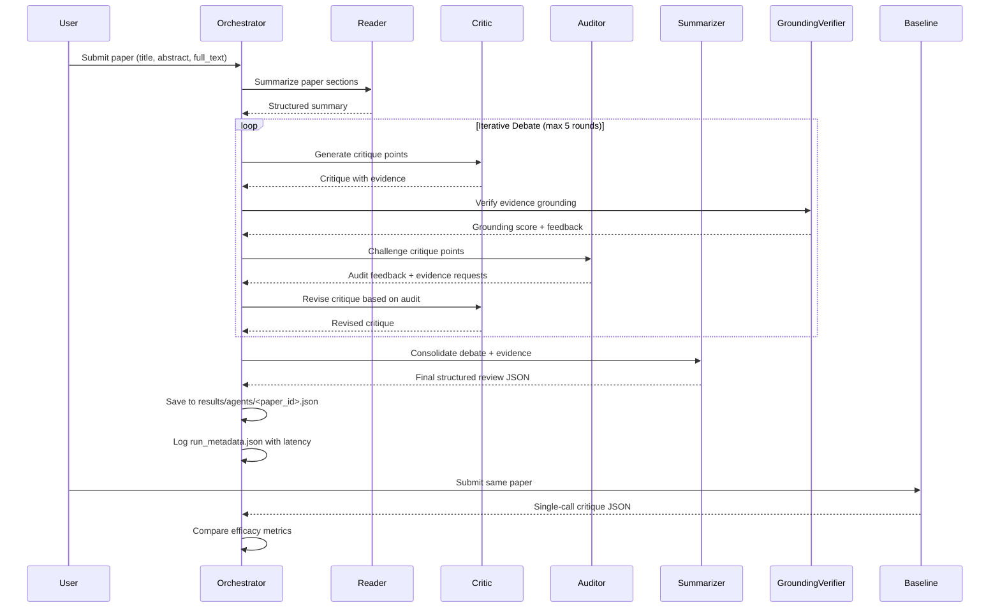

# Design Document: AI Research Paper Critique Assistant

## Overview

Build an autonomous, multi-agent LLM pipeline for generating peer-review-style critiques of academic research papers. The system uses LangGraph for stateful orchestration with Google Cloud Vertex AI (Gemini 1.5 Flash for loops, Gemini 1.5 Pro for final generation). A Grounding Verifier enforces evidence-based critique generation. The multi-agent approach will be compared against a single-call baseline to evaluate efficacy.

## Main Algorithm/Workflow



## Core Interfaces/Types

```python
from dataclasses import dataclass
from typing import Optional, List, Dict, Any
from enum import Enum
import time


class AgentRole(Enum):
    READER = "reader"
    CRITIC = "critic"
    AUDITOR = "auditor"
    SUMMARIZER = "summarizer"


@dataclass
class Paper:
    paper_id: str
    title: str
    abstract: str
    full_text: str
    reviews: Optional[List[Dict[str, Any]]] = None


@dataclass
class CritiquePoint:
    point: str
    evidence: str
    confidence: float  # 0.0 to 1.0


@dataclass
class StructuredReview:
    summary: str
    strengths: List[CritiquePoint]
    weaknesses: List[CritiquePoint]
    questions: List[Dict[str, str]]
    scores: Dict[str, int]


@dataclass
class AgentMessage:
    role: AgentRole
    content: str
    timestamp: float = field(default_factory=time.time)
    tool_calls: Optional[List[Dict[str, Any]]] = None
    tool_results: Optional[List[Dict[str, Any]] = None


@dataclass
class DebateRound:
    critic_message: AgentMessage
    auditor_message: AgentMessage
    grounding_scores: Dict[str, float]
    revised_critic_message: Optional[AgentMessage] = None


@dataclass
class CritiqueResult:
    paper_id: str
    model: str
    rounds: int
    latency_seconds: float
    token_usage: Dict[str, int]
    transcript: List[AgentMessage]
    structured: StructuredReview
    critique_points: Dict[str, str]
    grounding_verifier_scores: Dict[str, float]
    run_metadata: Dict[str, Any]
```

## Key Functions with Formal Specifications

### Function 1: `run_agentic_critique(paper, config)`

```python
def run_agentic_critique(
    paper: Paper,
    config: Dict[str, Any]
) -> CritiqueResult:
```

**Preconditions:**
- `paper` is a valid Paper object with non-empty title and abstract
- `config` contains all required agent configurations (models, max_rounds, tool settings)
- `config["agent"]["max_rounds"]` is between 1 and 5
- All agent models are valid model identifiers

**Postconditions:**
- Returns a CritiqueResult with complete transcript
- `result.rounds` equals the number of debate rounds executed
- `result.latency_seconds` is the total execution time in seconds
- `result.token_usage` contains input and output token counts
- `result.grounding_verifier_scores` contains evidence grounding metrics
- `result.run_metadata` includes latency in milliseconds

**Loop Invariants:**
- For each debate round: `round_num <= config["agent"]["max_rounds"]`
- Transcript grows by exactly 2 messages per round (Critic + Auditor)
- Grounding verification runs after each Critic message

### Function 2: `verify_grounding(critique_point, paper_section, config)`

```python
def verify_grounding(
    critique_point: CritiquePoint,
    paper_section: str,
    config: Dict[str, Any]
) -> Dict[str, Any]:
```

**Preconditions:**
- `critique_point` contains both `point` and `evidence` fields
- `paper_section` is a non-empty string containing relevant paper content
- `config` contains grounding verifier settings (model, max_tokens)

**Postconditions:**
- Returns dict with `is_supported` (boolean), `confidence` (float 0-1), `evidence_match_score` (float 0-1)
- If `is_supported` is True: `evidence_match_score >= 0.7`
- If `is_supported` is False: `evidence_match_score < 0.5`
- Execution time is minimized using low-cost LLM sub-calls

**Loop Invariants:**
- N/A (single LLM call)

### Function 3: `build_agents(config)`

```python
def build_agents(
    config: Dict[str, Any]
) -> Dict[AgentRole, BaseAgent]:
```

**Preconditions:**
- `config` contains agent model mappings in `config["agent"]["model_map"]`
- Default models are provided for each role if not in model_map
- `config["agent"]["use_tools"]` is a boolean

**Postconditions:**
- Returns dict mapping each AgentRole to a configured BaseAgent instance
- Each agent has correct system prompt based on role
- Tool-use is enabled/disabled based on config
- Token usage tracking is initialized

**Loop Invariants:**
- All 4 agent roles are present in returned dict
- Agent models match config specifications

### Function 4: `run_baseline_critique(paper, config)`

```python
def run_baseline_critique(
    paper: Paper,
    config: Dict[str, Any]
) -> CritiqueResult:
```

**Preconditions:**
- `paper` is a valid Paper object
- `config["models"]["baseline"]` specifies a valid model

**Postconditions:**
- Returns CritiqueResult with single LLM call
- `result.rounds` equals 0 (no debate)
- `result.latency_seconds` is typically lower than agentic version
- Output format matches agentic result structure

**Loop Invariants:**
- N/A (single call, no iteration)

## Algorithmic Pseudocode

### Main Agentic Loop

```pascal
ALGORITHM run_agentic_critique(paper, config)
INPUT: paper (Paper), config (Dict)
OUTPUT: result (CritiqueResult)

BEGIN
  t0 ← current_timestamp()
  
  // Initialize agents
  agents ← build_agents(config)
  transcript ← empty_list()
  
  // Step 1: Reader summarizes paper
  summary ← agents[READER].summarise_paper(paper)
  transcript.append(AgentMessage(READER, summary))
  
  // Step 2: Critic generates initial critique
  initial_critique ← agents[CRITIC].generate_critique(summary)
  transcript.append(AgentMessage(CRITIC, initial_critique))
  
  // Step 3-4: Iterative debate loop
  rounds_done ← 0
  FOR round_num ← 1 TO config["agent"]["max_rounds"] DO
    // Auditor challenges the critique
    audit_feedback ← agents[AUDITOR].audit(
      initial_critique, 
      summary
    )
    transcript.append(AgentMessage(AUDITOR, audit_feedback))
    rounds_done ← rounds_done + 1
    
    // Check early stopping conditions
    IF should_stop_debate(audit_feedback, config) THEN
      BREAK
    END IF
    
    // Critic revises based on audit
    revised_critique ← agents[CRITIC].revise_critique(audit_feedback)
    transcript.append(AgentMessage(CRITIC, revised_critique))
    
    // Verify grounding of revised critique
    grounding_scores ← verify_all_grounding(
      revised_critique, 
      paper, 
      config
    )
  END FOR
  
  // Step 5: Summarizer consolidates
  full_debate ← build_debate_context(transcript, config)
  final_review ← agents[SUMMARIZER].summarise(full_debate)
  transcript.append(AgentMessage(SUMMARIZER, final_review))
  
  // Parse structured output
  structured ← parse_structured_output(final_review)
  critique_points ← flatten_to_critique_points(structured)
  
  // Calculate latency and token usage
  latency_seconds ← (current_timestamp() - t0) / 1000.0
  total_tokens ← sum(agent.token_usage for agent in agents)
  
  RETURN CritiqueResult(
    paper_id=paper.paper_id,
    model=config["models"]["strong"],
    rounds=rounds_done,
    latency_seconds=latency_seconds,
    token_usage=total_tokens,
    transcript=transcript,
    structured=structured,
    critique_points=critique_points,
    grounding_verifier_scores=grounding_scores,
    run_metadata={
      "latency_ms": latency_seconds * 1000,
      "timestamp": current_timestamp(),
      "config_hash": hash_config(config)
    }
  )
END
```

### Grounding Verification Algorithm

```pascal
ALGORITHM verify_grounding(critique_point, paper_section, config)
INPUT: critique_point (CritiquePoint), paper_section (str), config (Dict)
OUTPUT: verification_result (Dict with is_supported, confidence, evidence_match_score)

BEGIN
  // Extract evidence claim from critique point
  evidence_claim ← critique_point.evidence
  
  // Use low-cost LLM for sub-call
  client ← get_vertex_ai_client(config["models"]["fast"])
  
  // Construct verification prompt
  prompt ← format_grounding_prompt(evidence_claim, paper_section)
  
  // Make LLM call
  response ← client.generate_content(
    model=config["models"]["fast"],
    prompt=prompt,
    max_tokens=config["max_tokens"]
  )
  
  // Parse verification result
  verification ← parse_verification_response(response.text)
  
  RETURN {
    "is_supported": verification["is_supported"],
    "confidence": verification["confidence"],
    "evidence_match_score": verification["evidence_match_score"]
  }
END

ALGORITHM verify_all_grounding(critique_text, paper, config)
INPUT: critique_text (str), paper (Paper), config (Dict)
OUTPUT: overall_scores (Dict)

BEGIN
  // Extract individual critique points
  points ← extract_critique_points(critique_text)
  
  overall_scores ← {
    "avg_confidence": 0.0,
    "grounding_rate": 0.0,
    "points_verified": 0,
    "points_unsupported": 0
  }
  
  total_confidence ← 0.0
  supported_count ← 0
  
  FOR each point IN points DO
    // Find relevant paper section for this point
    section ← find_relevant_section(point, paper)
    
    // Verify grounding
    result ← verify_grounding(point, section, config)
    
    total_confidence ← total_confidence + result["confidence"]
    IF result["is_supported"] THEN
      supported_count ← supported_count + 1
    END IF
    
    overall_scores["points_verified"] ← overall_scores["points_verified"] + 1
    IF NOT result["is_supported"] THEN
      overall_scores["points_unsupported"] ← overall_scores["points_unsupported"] + 1
    END IF
  END FOR
  
  // Calculate aggregates
  IF overall_scores["points_verified"] > 0 THEN
    overall_scores["avg_confidence"] ← total_confidence / overall_scores["points_verified"]
    overall_scores["grounding_rate"] ← supported_count / overall_scores["points_verified"]
  END IF
  
  RETURN overall_scores
END
```

### Early Stopping Detection

```pascal
ALGORITHM should_stop_debate(audit_feedback, config)
INPUT: audit_feedback (str), config (Dict)
OUTPUT: should_stop (bool)

BEGIN
  feedback_lower ← to_lowercase(audit_feedback)
  
  FOR each phrase IN config["agent"]["early_stop_phrases"] DO
    idx ← find_substring(feedback_lower, phrase)
    
    IF idx >= 0 THEN
      // Check for negation in context
      context_start ← max(0, idx - 15)
      context ← feedback_lower[context_start:idx]
      
      IF NOT contains_negation(context) THEN
        RETURN true
      END IF
    END IF
  END FOR
  
  RETURN false
END

FUNCTION contains_negation(text)
INPUT: text (str)
OUTPUT: has_negation (bool)

BEGIN
  negation_keywords ← ["not", "no ", "don't", "isn't", "hardly", "never"]
  
  FOR each keyword IN negation_keywords DO
    IF contains_substring(text, keyword) THEN
      RETURN true
    END IF
  END FOR
  
  RETURN false
END
```

## Example Usage

```python
# Example 1: Run agentic critique
from src.agents.orchestrator import run_agentic_critique
from src.agents.agents import Paper

paper = Paper(
    paper_id="paper_0001",
    title="Attention Is All You Need",
    abstract="The dominant sequence transduction models are based on complex recurrent or convolutional neural networks...",
    full_text="...[full paper text]...",
    reviews=[]
)

config = load_config("config.yaml")
result = run_agentic_critique(paper, config)

print(f"Rounds: {result.rounds}")
print(f"Latency: {result.latency_seconds}s")
print(f"Grounding rate: {result.grounding_verifier_scores['grounding_rate']}")

# Example 2: Compare with baseline
from src.baseline.baseline_critique import run_baseline_critique

baseline_result = run_baseline_critique(paper, config)

# Example 3: Save results with metadata
import json
from pathlib import Path

output_dir = Path("results/agents")
output_dir.mkdir(parents=True, exist_ok=True)

output_file = output_dir / f"{paper.paper_id}.json"
with open(output_file, "w") as f:
    json.dump({
        "paper_id": result.paper_id,
        "model": result.model,
        "rounds": result.rounds,
        "latency_seconds": result.latency_seconds,
        "token_usage": result.token_usage,
        "transcript": [
            {"role": m.role.value, "content": m.content}
            for m in result.transcript
        ],
        "structured": {
            "summary": result.structured.summary,
            "strengths": [
                {"point": s.point, "evidence": s.evidence}
                for s in result.structured.strengths
            ],
            "weaknesses": [
                {"point": w.point, "evidence": w.evidence}
                for w in result.structured.weaknesses
            ],
            "questions": result.structured.questions,
            "scores": result.structured.scores
        },
        "critique_points": result.critique_points,
        "grounding_verifier_scores": result.grounding_verifier_scores,
        "run_metadata": result.run_metadata
    }, f, indent=2)

# Log latency to run_metadata.json
metadata_file = output_dir / "run_metadata.json"
metadata = {
    "paper_id": paper.paper_id,
    "latency_ms": result.run_metadata["latency_ms"],
    "timestamp": result.run_metadata["timestamp"]
}
with open(metadata_file, "a") as f:
    json.dump(metadata, f)
    f.write("\n")
```

## Correctness Properties

**Property 1: Transcript Completeness**
```
∀ result ∈ CritiqueResult, 
  |result.transcript| = 1 (Reader) + 1 (Critic initial) + 2 * result.rounds + 1 (Summarizer)
```

**Property 2: Latency Tracking**
```
∀ result ∈ CritiqueResult,
  result.run_metadata["latency_ms"] = result.latency_seconds * 1000
```

**Property 3: Grounding Verification Bounds**
```
∀ result ∈ CritiqueResult,
  0.0 ≤ result.grounding_verifier_scores["avg_confidence"] ≤ 1.0 ∧
  0.0 ≤ result.grounding_verifier_scores["grounding_rate"] ≤ 1.0
```

**Property 4: Round Count Bounds**
```
∀ result ∈ CritiqueResult,
  0 ≤ result.rounds ≤ config["agent"]["max_rounds"]
```

**Property 5: Output Schema Compliance**
```
∀ result ∈ CritiqueResult,
  result.structured has fields: summary, strengths, weaknesses, questions, scores ∧
  result.structured.scores has fields: correctness, novelty, recommendation, confidence
```

## Error Handling

### Error Scenario 1: LLM API Failure

**Condition**: LLM API call fails with rate limit or timeout error
**Response**: Retry with exponential backoff (max 3 attempts)
**Recovery**: If all retries fail, log error and return partial result with error flag

### Error Scenario 2: JSON Parsing Failure

**Condition**: LLM response cannot be parsed as valid JSON
**Response**: Use fallback parsing with regex extraction
**Recovery**: If fallback fails, return empty structured output with warning

### Error Scenario 3: Missing Ground-Truth Data

**Condition**: Paper has no reviews for context
**Response**: Proceed with critique but flag as "no_review_context"
**Recovery**: Continue processing; evaluation will skip this paper

### Error Scenario 4: Token Limit Exceeded

**Condition**: Paper text exceeds model context window
**Response**: Truncate to `config["agent"]["truncate_body_chars"]` (default 12000)
**Recovery**: Log truncation warning; proceed with truncated text

## Testing Strategy

### Unit Testing Approach

**Test Cases**:
1. `test_verify_grounding_with_supported_evidence`: Verify grounding returns high confidence when evidence is present
2. `test_verify_grounding_with_unsupported_evidence`: Verify grounding returns low confidence when evidence is absent
3. `test_should_stop_debate_with_positive_phrases`: Verify early stopping triggers on satisfaction phrases
4. `test_should_stop_debate_with_negation`: Verify early stopping does NOT trigger on negated phrases
5. `test_run_agentic_critique_full_flow`: Verify complete agentic loop produces valid output

**Coverage Goals**:
- All agent roles tested with mock LLM responses
- Grounding verification tested with various evidence scenarios
- Error handling paths tested with injected failures

### Property-Based Testing Approach

**Property Test Library**: `fast-check`

**Property 1: Transcript Length Invariant**
```python
def test_transcript_length_invariant():
    for paper, config in sample_papers_and_configs():
        result = run_agentic_critique(paper, config)
        expected_length = 3 + 2 * result.rounds  # Reader + Critic + Summarizer + 2*rounds
        assert len(result.transcript) == expected_length
```

**Property 2: Latency Consistency**
```python
def test_latency_consistency():
    for paper, config in sample_papers_and_configs():
        result = run_agentic_critique(paper, config)
        assert abs(result.run_metadata["latency_ms"] - result.latency_seconds * 1000) < 1.0
```

**Property 3: Grounding Score Bounds**
```python
def test_grounding_score_bounds():
    for paper, config in sample_papers_and_configs():
        result = run_agentic_critique(paper, config)
        scores = result.grounding_verifier_scores
        assert 0.0 <= scores["avg_confidence"] <= 1.0
        assert 0.0 <= scores["grounding_rate"] <= 1.0
```

### Integration Testing Approach

**Test Scenarios**:
1. End-to-end critique generation for sample papers
2. Comparison with baseline output format compatibility
3. Grounding verification integration with actual LLM calls
4. Multi-paper batch processing with metadata logging

## Performance Considerations

**Latency Requirements**:
- Single agentic critique: < 60 seconds (including 5 rounds)
- Baseline critique: < 30 seconds
- Grounding verification per point: < 5 seconds (using low-cost model)

**Token Budget**:
- Reader: ~2000 input tokens, ~500 output tokens
- Critic: ~3000 input tokens, ~1000 output tokens per round
- Auditor: ~2500 input tokens, ~800 output tokens per round
- Summarizer: ~5000 input tokens, ~1500 output tokens

**Optimization Strategies**:
- Use cheaper models (Gemini 1.5 Flash) for iterative rounds
- Use expensive models (Gemini 1.5 Pro) only for final generation
- Implement early stopping to reduce unnecessary rounds
- Cache paper section embeddings for grounding verification

## Security Considerations

**Input Validation**:
- Sanitize paper text to prevent prompt injection
- Validate model identifiers against allowed list
- Limit paper size to prevent DoS via token exhaustion

**Output Validation**:
- Validate JSON schema compliance before saving
- Sanitize critique points to prevent XSS in downstream systems
- Log all API calls for audit trail

**Rate Limiting**:
- Implement circuit breaker for LLM API calls
- Queue requests when rate limits approached
- Graceful degradation when API unavailable

## Dependencies

**External Dependencies**:
- `langgraph` - Stateful orchestration
- `google-cloud-vertexai` - Vertex AI integration
- `pydantic` - Data validation and serialization
- `python-dotenv` - Environment variable management

**Internal Dependencies**:
- `src/agents/agents.py` - Agent role definitions
- `src/agents/tools.py` - Tool implementations
- `src/agents/orchestrator.py` - Main orchestration logic
- `src/baseline/baseline_critique.py` - Baseline comparison
- `src/evaluation/metrics.py` - Efficacy evaluation
- `src/evaluation/scorer.py` - Ground-truth comparison